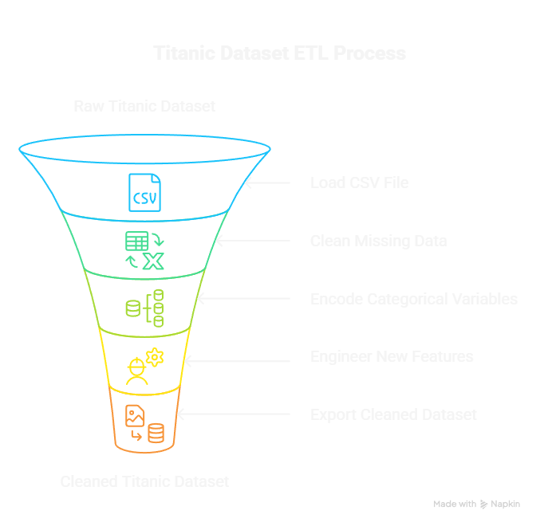

# 🛳 Titanic Dataset ETL Pipeline(TASK 1)

This project demonstrates an end-to-end ETL (Extract, Transform, Load) pipeline using the classic Titanic dataset. The goal is to prepare the data for further analysis and modeling by cleaning missing values, encoding categorical variables, and engineering new features.

---
## 🖼️ ETL Process Diagram



---
## 📂 Dataset

- **Source:** [Kaggle - Titanic Dataset](https://www.kaggle.com/datasets/yasserh/titanic-dataset)
- **File Used:** `Titanic-Dataset.csv`

---

## 🔄 ETL Pipeline Overview

Load CSV → Clean Missing Data → Encode Categorical Variables → Engineer Features → Export Cleaned Dataset


### Key Steps:

- Fill missing values (`Age`, `Embarked`, `Cabin`)
- Drop irrelevant column (`Ticket`)
- Label encode categorical variables (`Sex`, `Embarked`)
- Engineer new features: 
  - `FamilySize` = `SibSp` + `Parch` + 1
  - `IsAlone` (1 if traveling alone, else 0)
  - `Title` extracted from `Name` and label encoded

---

## 🛠️ Setup Instructions

### 1. Clone or Download the Repository
```bash
git clone https://github.com/your-username/titanic-etl.git
cd titanic-etl
---
### 2. Install Required Packages:
Ensure you have Python 3.x installed. Then install dependencies:

pip install pandas scikit-learn

## ▶️ How to Run
Run in Jupyter Notebook:
Open Titanic_ETL_Notebook.ipynb in Jupyter and run all cells.

Or run Python script:
python titanic_et1.py --input Titanic-Dataset.csv --output cleaned_titanic_data.csv

📁 Output
Cleaned data saved as cleaned_titanic_data.csv

Logs printed in terminal for every ETL step

👩‍💻 Author
Laksha Mandiye
Data Science Intern @ TechNest
LinkedIn | GitHub

🙏 Acknowledgments
Titanic dataset by Kaggle

Assistance from Julius AI, Napkin AI, NotebookLM, and ChatGPT
